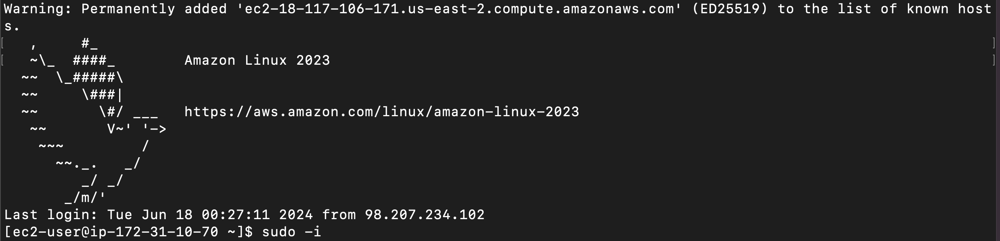

In this file, write all the credentials needed to access to your application. For example, your app and database credentials.
This information will be used by your CTO and leads to have access some components of your app. 

In addition, you should provide short tutorials to teach people how to access to all the 
components of your application. For instance, if you created a MySQL instance, you must provide 
a short description of how to use the credentials provided here to access to your database instance via ssh or 
using MySQLWorkbench. 

Points will be deducted if teams do not add their credentials here once they have chosen their 
technology stack or if their step-by-step descriptions are not clear enough. You have been warned! 
-------------------------------------------------------------------------------------
## Tutorial on How to Use .ssh keys to Connect to AWS Instance:
1. Open up a terminal and cd into the directory where the .ssh key is located.
2. Enter in the command `chmod 400 <name of your .ssh key>` . As an example, we named our key CSC648KeyPair.pem, so in the terminal 
we enter `chmod 400 CSC648KeyPair.pem`
3. Next, you are going to use the `ssh -i` command along with your .ssh key, followed by your DNS. It should look like the following: `ssh -i CSC648KeyPair.pem ec2-user@ec2-18-117-106-171.us-east-2.compute.amazonaws.com`

**Note to user: DNS is different every time**

4. The following lines are going to print to the terminal:

The authenticity of host 'ec2-18-117-106-171.us-east-2.compute.amazonaws.com (18.117.106.171)' can't be established.
ED25519 key fingerprint is SHA256:5vvfWdiRSmDcumLgAF8ip2HdHmi6elhJBIqiI7D5/rU.
This key is not known by any other names
Are you sure you want to continue connecting (yes/no/[fingerprint])?

Enter `yes`
5. The following lines will then print to the terminal:

6. To get root user, type in the command `sudo -i`, as shown in the picture above.
Execute the following commands in the order given:
To get root user, type in the command sudo -i, as shown in the picture above.
Execute the following commands in the order given:
`cd ../` (to get out into the "/" directory)
`cd home/ec2-user` (to get into where we cloned the repo)
`cd [repo name]` (repo name is sfsu-joseo/csc648-848-05-sw-engineering-su24-T4)
`git fetch`
`git pull` (this is to update the instance to most modern version of the repo)
`cd application` (this is where the node package is)
`npm install` (this will install all dependencies listed inside of the package.json)
`node app.js` (this opens node listening on port 3000)

