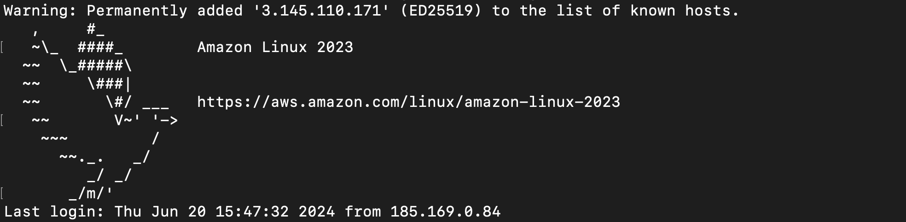
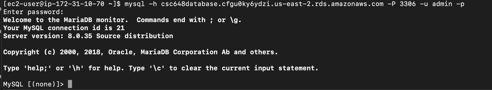

-------------------------------------------------------------------------------------
# Credentials
- Updated DNS: ec2-3-145-110-171.us-east-2.compute.amazonaws.com
- Updated IP: 3.145.110.171
- Updated IP (with port): 3.145.110.171:3000 
- Key Pair (name): CSC648KeyPair.pem 

## App:
- Updated Website URL: http://3.145.110.171:3000/
- SSH URL: ec2-user@ec2-3-145-110-171.us-east-2.compute.amazonaws.com
- SSH Username: ec2-user
- SSH Password/Key: .pem file uploaded to credentials folder

## Database:
- Database URL: csc648database.cfgu0ky6ydzi.us-east-2.rds.amazonaws.com
- Database Username: admin
- Database Password: vdpE9YYQiaGl6VWibkiO

# Tutorials
## Tutorial on How to Use .ssh keys to Connect to AWS Instance:
1. Open up a terminal and cd into the directory where the .ssh key is located.
2. Enter in the command `chmod 400 <name of your .ssh key>` . As an example, we named our key CSC648KeyPair.pem, so in the terminal 
we enter `chmod 400 CSC648KeyPair.pem`
3. Next, you are going to use the `ssh -i` command along with your .ssh key, followed by your DNS (located in **Credentials** section as 'Updated DNS'). It should look like the following: `ssh -i CSC648KeyPair.pem ec2-user@ec2-18-117-106-171.us-east-2.compute.amazonaws.com`

**Note to user: DNS is different every time server is up**

4. The following lines are going to print to the terminal:

The authenticity of host 'ec2-18-117-106-171.us-east-2.compute.amazonaws.com (18.117.106.171)' can't be established.
ED25519 key fingerprint is SHA256:5vvfWdiRSmDcumLgAF8ip2HdHmi6elhJBIqiI7D5/rU.
This key is not known by any other names
Are you sure you want to continue connecting (yes/no/[fingerprint])?

Enter `yes`

5. The following lines will then print to the terminal:

6. To get root user, type in the command `sudo -i`, as shown in the picture above.
Execute the following commands in the order given:

- `cd ../` (to get out into the "/" directory)
- `cd home/ec2-user` (to get into where we cloned the repo)
- `cd [repo name]` (repo name is sfsu-joseo/csc648-848-05-sw-engineering-su24-T4)
- `git fetch`
- `git pull` (this is to update the instance to most modern version of the repo)
- `cd application` (this is where the node package is)
- `npm install` (this will install all dependencies listed inside of the package.json)
- `node app.js` (this opens node listening on port 3000)

## Tutorial on How to Access Database Instance via ssh:
1. Open up a terminal and cd into the directory where the .ssh key is located.
2. Enter in the command `chmod 400 <name of your .ssh key>` . As an example, we named our key CSC648KeyPair.pem, so in the terminal 
we enter `chmod 400 CSC648KeyPair.pem`
3. Next, you are going to use the `ssh -i` command along with your .ssh key, followed by `ec2-user` + your Public IPv4 address (located in **Credentials** section as 'Updated IP'). It should look like the following: `ssh -i CSC648KeyPair.pem ec2-user@3.145.110.171`

**Note to user: Public IPv4 address is different every time server is up**

4. The following lines are going to print to the terminal:

The authenticity of host '3.145.110.171 (3.145.110.171)' can't be established.
ED25519 key fingerprint is SHA256:5vvfWdiRSmDcumLgAF8ip2HdHmi6elhJBIqiI7D5/rU.
This host key is known by the following other names/addresses:
    ~/.ssh/known_hosts:6: ec2-18-117-106-171.us-east-2.compute.amazonaws.com
    ~/.ssh/known_hosts:8: ec2-3-137-213-220.us-east-2.compute.amazonaws.com
    ~/.ssh/known_hosts:9: ec2-3-145-110-171.us-east-2.compute.amazonaws.com
Are you sure you want to continue connecting (yes/no/[fingerprint])?

Enter `yes`

5. The following lines will then print to the terminal:

6. Enter the following command to connect with the MySQL instance:

`mysql -h csc648database.cfgu0ky6ydzi.us-east-2.rds.amazonaws.com -P 3306 -u admin -p`

**Note to user: `csc648database.cfgu0ky6ydzi.us-east-2.rds.amazonaws.com` is the endpoint of the DB instance**

7. Enter the master password (located under **Credentials** section as 'Database Password') when prompted `Enter password:`.

8. The following lines will then print to the terminal:

